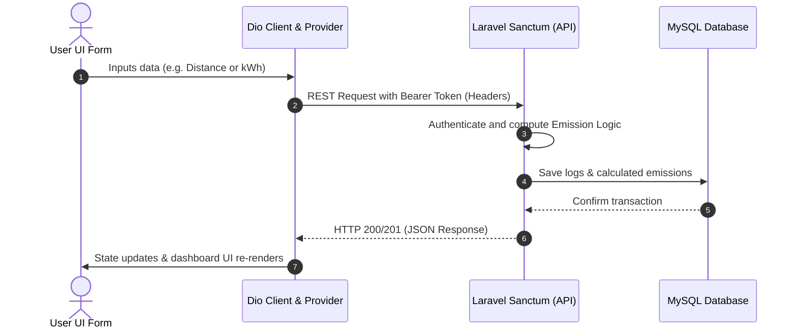

# EcoTrack MVP - Technical Blueprint

This document outlines the architecture, database schema, networking configuration, state management, and data flow of the EcoTrack application (Laravel API + Flutter Client) for easy processing by developers and AI/LLM models.

---

## 1. Directory Structure (Flutter Client)

```plaintext
lib/
├── data/
│   └── api/
│       └── api_client.dart       # Dio configuration with request token interceptor
├── providers/
│   └── auth_provider.dart        # Authentication state (Login, Register, Logout)
├── views/
│   ├── auth/
│   │   ├── login_view.dart        # Responsive Login screen (Mobile / Web)
│   │   └── register_view.dart     # Responsive Register screen (Mobile / Web)
│   └── dashboard/
│       └── dashboard_view.dart    # Dashboard placeholder & main activity view
├── app.dart                       # Global MaterialApp theme & Auth router
└── main.dart                      # App entry point (main function)
```

---

## 2. Dependencies & Core Packages

Dependencies managed in `pubspec.yaml`:
- **State Management**: `provider` (`^6.1.2`)
- **HTTP Client**: `dio` (`^5.7.0`)
- **Secure Storage**: `flutter_secure_storage` (`^9.2.2`)
- **UI & Formatting**: `fl_chart` (`^0.69.0`) & `intl` (`^0.19.0`)

---

## 3. Backend Architecture (Laravel 11 API)

### A. Database Schema & Relations
- **`users`**: Core user credentials (`id`, `name`, `email`, `password`).
- **`transport_types`**: Master data for transport vehicles.
  - *Seed Data*:
    - ID 1: Mobil Bensin (Emission Factor: `0.1920`)
    - ID 2: Motor (Emission Factor: `0.1030`)
    - ID 4: Bus Umum (Emission Factor: `0.0350`)
- **`transport_logs`**: Logged transport trips (`id`, `user_id`, `transport_type_id`, `distance`, `calculated_emission`, `activity_date`).
  - *Relations*: `belongsTo(User)`, `belongsTo(TransportType)`.
- **`electricity_logs`**: Logged electricity consumption (`id`, `user_id`, `kwh`, `period`, `calculated_emission`, `logging_date`).
  - *Relations*: `belongsTo(User)`.

### B. Core Business Logic (app/Services)
- **`AuthService`**: Manages registrations (`User::create`), authentication via Bcrypt (`Hash::check`), issuing API tokens (`createToken`), and token revocation.
- **`TransportService`**: Retrieves transport logs, calculates emissions:
  $$\text{Calculated Emission} = \text{Distance (km)} \times \text{Emission Factor}$$
- **`ElectricityService`**: Retrieves electricity logs, calculates regional emissions (Indonesia grid conversion):
  $$\text{Calculated Emission} = \text{kWh} \times 0.87$$

### C. Controllers & Routes (routes/api.php)
- Clean Controllers (Skinny Controller Pattern) forwarding requests to dedicated services.
- **`auth:sanctum` Guard**: Secures profile, transport logs, and electricity logs endpoints. HTTP Headers require `Authorization: Bearer <token>`.

---

## 4. Frontend Architecture (Flutter Client)

### A. Networking Client (`api_client.dart`)
Configures a centralized `Dio` HTTP client with a base URL of `http://10.0.2.2:8000/api` (Android Emulator localhost mapping). Uses interceptors to inject stored secure tokens into HTTP Headers automatically.

### B. Authentication State (`auth_provider.dart`)
- **State Fields**:
  - `bool isLoading`: Indicates active loading states.
  - `String? token`: Stores the bearer token in-memory.
- **Methods**:
  - `login(email, password)`: Authenticates credentials and stores the returned token to secure storage.
  - `register(name, email, password, password_confirmation)`: Registers a user and saves the session token.
  - `tryAutoLogin()`: Restores stored tokens on boot (Bypass login).
  - `logout()`: Clears local secure storage and calls backend token revoke API.

### C. Presentation Layer & UI Guidelines
- **Theme**: Premium Emerald Green (`0xFF10B981`) combined with soft gray backgrounds (`0xFFF8FAFC`) and high-contrast charcoal text.
- **Typography**: `FiraSans` for technical and dashboard screens.
- **Views**:
  - **`LoginView` & `RegisterView`**: Responsive layout using viewport width thresholds.
    - Width > 800 (Web/Desktop): Splitted layout with left marketing/impact banner and right focused form card.
    - Width <= 800 (Mobile): Minimalist, centered form layout optimized for screen height.

---

## 5. End-to-End Data Flow

